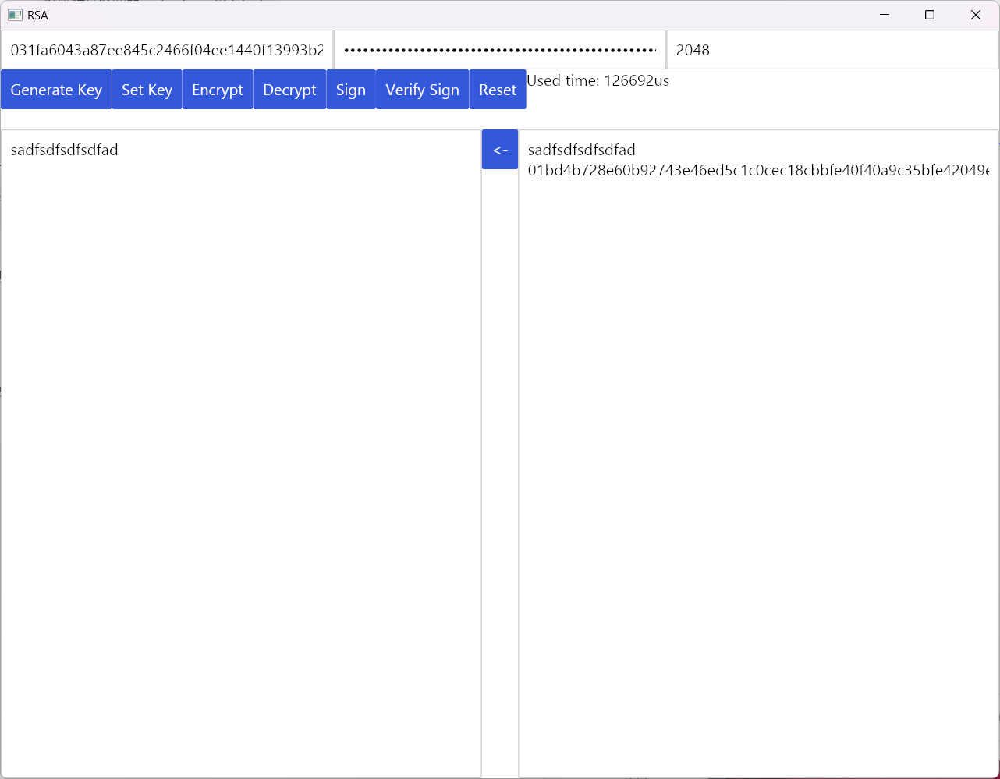
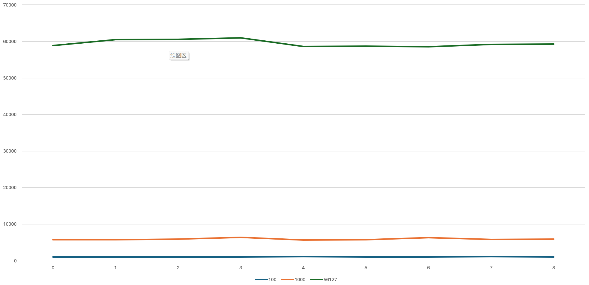

# 应用密码学期中大作业：RSA

## 使用说明

使用提供的 exe 可以直接在 Windows x64 上运行。若需要编译，需要安装 Rust nightly 环境，然后在提交目录下运行 `cargo build -r` 即可。注意 `-r` 为必须，否则将编译 Debug 版本，性能极差。

程序界面如图，从上到下分别是：

-   公钥、私钥及密钥长度
-   功能按钮、操作用时
-   输入、<-按钮、输出
    -   <-按钮将输出覆盖到输入，并清空输出

### 生成密钥

如图，按 "Generate Key" 可以生成指定长度的密钥（最大支持 2048 位），并显示生成用时。或者，也可以手动在公钥、私钥栏填写本程序生成的密钥，按 "Set Key" 设置它，此时密钥长度将自动校准。

### 加密、解密

可以在输入框中输入任意英文、数字、符号、空格、换行，然后按下加密，获得加密结果。可以按<-按钮，然后尝试解密，获得原本的内容。

### 签名、验证签名

可以在输入框中输入**单行**文本，按下签名获得结果。结果第一行为原输入，第二行为签名。可以按<-按钮，然后尝试验证签名，若成功第一行输出 true，否则输出 false，第二行为验签算法解出的消息。

签名验证尚不稳定，有时会失败，这是由于验签结果转换为 utf8 字符串后因为某些原因，可能不与原消息完全一致，而不是算法实现的原因，因为时间原因，难以继续 debug。可以人工查看输出第二行是否与输入相符。

## 代码实现亮点

-   使用巴雷特模乘实现快速的大数模运算。(algorithms.rs:6)
-   使用 Miller Rabin 素数检测算法。(algorithms.rs:87)
    -   在使用此算法检测前，首先尝试 1-10000 内所有的质数作为快速筛查。
    -   参考 OpenSSL 实现进行 64 次检测，达到速度和可靠性之间的平衡。

## 参考论文信息

Barrett, P. (1986). "Implementing the Rivest Shamir and Adleman Public Key Encryption Algorithm on a Standard Digital Signal Processor". Advances in Cryptology – CRYPTO' 86. Lecture Notes in Computer Science. Vol. 263. pp. 311–323. doi:10.1007/3-540-47721-7_24. ISBN 978-3-540-18047-0. [清华图书馆链接](https://discover.lib.tsinghua.edu.cn/entrance/searchEntrance/resourceDetail?id=86THU_ALMA_US51781532950003966&search_scope=default_scope&title=Advances%20in%20cryptology--CRYPTO%20%2786%20%3A%20proceedings%20%2F&version=&frbrgroupid=809571604&context=L&adaptor=Local%20Search%20Engine&query=any,contains,Implementing%20the%20Rivest%20Shamir%20and%20Adleman%20Public%20Key%20Encryption%20Algorithm%20on%20a%20Standard%20Digital%20Signal%20Processor&isFrbr=true)

## 性能评估

所有时间数据的单位为 us。

### 密钥生成

各尝试生成 10 次长度为 768、1024、2048 的密钥，结果如下。

| 次数 | 768         | 1024        | 2048        |
| ---- | ----------- | ----------- | ----------- |
| 0    | 186365      | 399581      | 3539867     |
| 1    | 154260      | 435534      | 3488552     |
| 2    | 128152      | 293717      | 5454345     |
| 3    | 147983      | 327278      | 5401610     |
| 4    | 195945      | 399160      | 3851312     |
| 5    | 186458      | 310278      | 4998486     |
| 6    | 162464      | 381288      | 6553158     |
| 7    | 156556      | 411334      | 5067605     |
| 8    | 157545      | 368934      | 3359612     |
| 9    | 134199      | 521221      | 4345142     |
| 平均 | 146426.8182 | 349940.8182 | 4187430.636 |

### 加密

使用 2048 位密钥，尝试加密长度为 100, 1000, 10000 个字符的消息各 10 次，结果如下。

| 次数 | 100    | 1000   | 10000   |
| ---- | ------ | ------ | ------- |
| 0    | 1101   | 5718   | 56127   |
| 1    | 1080   | 5729   | 58905   |
| 2    | 1094   | 5741   | 60486   |
| 3    | 1091   | 5939   | 60557   |
| 4    | 1087   | 6423   | 61004   |
| 5    | 1103   | 5724   | 58629   |
| 6    | 1097   | 5802   | 58683   |
| 7    | 1097   | 6302   | 58558   |
| 8    | 1101   | 5820   | 59164   |
| 9    | 1095   | 5947   | 59264   |
| 平均 | 1094.6 | 5914.5 | 59137.7 |

## 实验收获

通过这次实验，我学习了 RSA 算法的基本原理和实现步骤，掌握了如何生成公钥和私钥，如何用公钥加密信息，如何用私钥解密信息。我也了解了 RSA 算法的优点和缺点，例如它的安全性高，但是速度慢，需要选择合适的密钥长度和加密模数等参数。我感受到了密码学的魅力，也体会到了编程的乐趣。我更加深刻地感受到了密码学在信息安全中的基础性作用。
